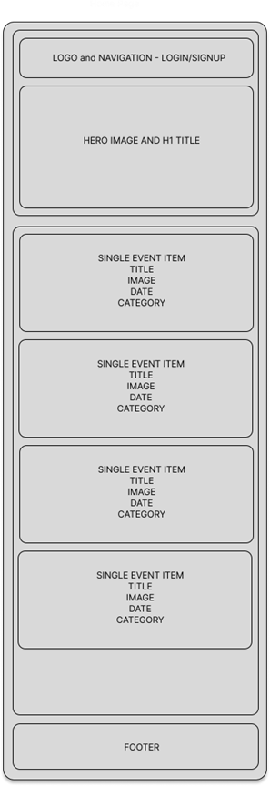
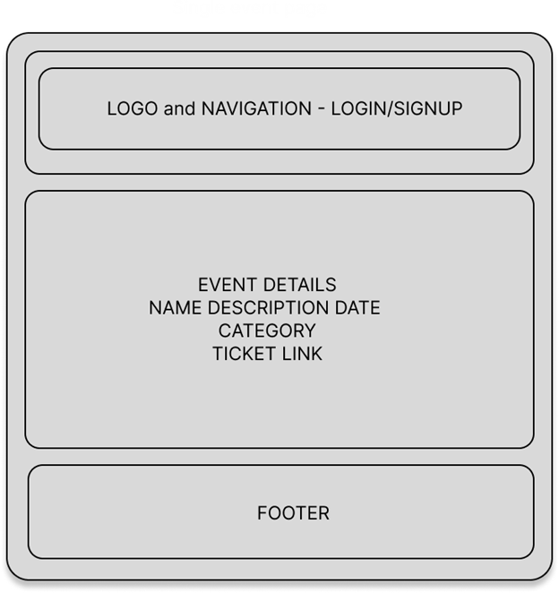
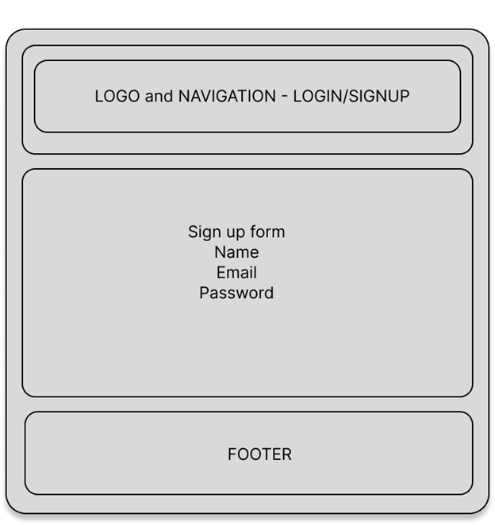
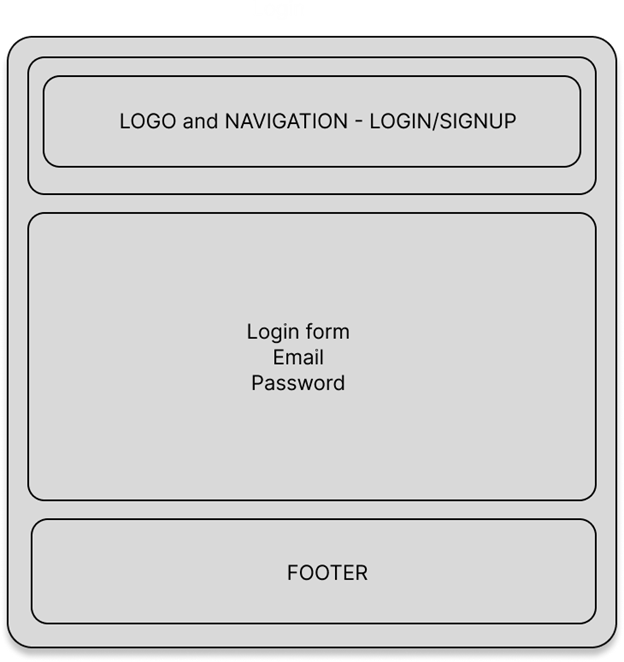
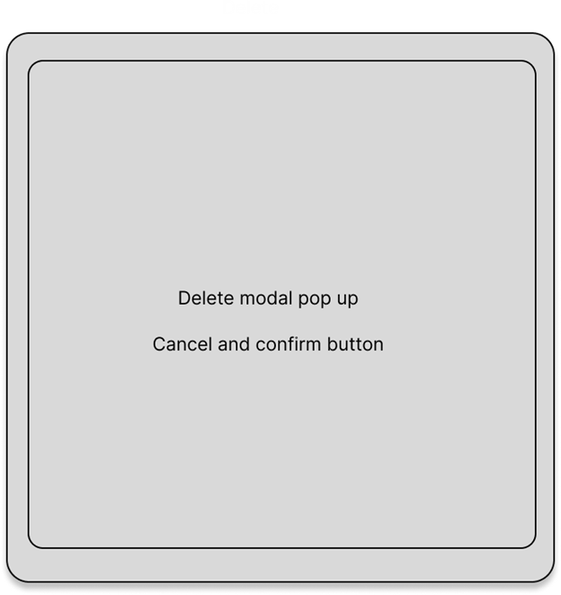

# Project Title

Squmaish Event Hub

## Overview

An event listing website platform where users can discover and share various events happening Squamish. Users can browse through different categories of events and view event details. Event organizers can create and manage their events, reaching a broader audience.

### Problem

Squamish locals and visitors often miss out on exciting events happening around them, uh FOMO! Event organizers struggle to promote their events effectively. This app aims to bridge the gap by providing a centralized platform for Squamish event discovery and promotion.

### User Profile

Locals or visitors looking for upcoming events in Squamish, whether it be music, outdoor, educational etc. - (View only)

Event organizers and business owners wanting to post and advertise their events - (May require sign up and login)

Users who want to save events to a calendar or "bucket list" page (nice to have - May require sign in and login)

### Features

<!-- List the functionality that your app will include. These can be written as user stories or descriptions with related details. Do not describe _how_ these features are implemented, only _what_ needs to be implemented. -->

As an organizer (logged in - nice to have):

- post an event to the site including event name, host, images, decription, price, type of event and ticket info
- events expire after the event date or can be deleted anytime
- events can be edited by the event organizer
- host dashboard - shows list of events host has added

As a user:

- view upcoming events in squamish
- filter or organize events by category, date, popularity (if using like stats)
- engage with event posting e.g. liking, sharing or commenting (nice to have)

As a logged in user (nice to have):

- save events to a wish list

General Site Features:

- weather bar showing the current and forecast weather (external api)
- responsive design

## Implementation

### Tech Stack

Frontend:

- React
- SCSS
- TypeScript (potentially)
- Client libraries:
  - react
  - react-router
  - axios - HTTP requests

Backend:

- Node
- knex
- express
- bcrypt for password hashing
- MySql

### APIs

Open weather map api for the current and forecast weather data

### Sitemap

<!-- List the pages of your app with brief descriptions. You can show this visually, or write it out. -->

Home Page

- displays events to browse
  Add Event
- add event form (logged in host)
  Edit Event
- edit eveit form (logged in host)
  Event details
- details of single event with link to tickets if applicable
  Register
- sign up form
  Login
- login form
  Dashboard (logged in host)
- profile details
- list of events by the logged in host

### Mockups

<!-- Provide visuals of your app's screens. You can use tools like Figma or pictures of hand-drawn sketches. -->

### Data

<!-- Describe your data and the relationships between them. You can show this visually using diagrams, or write it out. -->

User Table

- ID
- Name
- Email
- Password hash
- Role (Host or viewer) - potentially to show personalized dashboard

[Events by host: would be displayed by calling eventsByUserId from the Events table ]

Events Table

- ID
- Event_name
- Venue
- Description
- Date
- Category
- Ticket_link
- Image
- Likes
- Host_id (FK - Host ID)

<!-- ### Nice to have

User Table (if using user auth)

- ID
- Name
- Email
- Password
- Saved events (FK - Event ID) -->

### Endpoints

List endpoints that your server will implement, including HTTP methods, parameters, and example responses.

**GET/events**

- Get all events

Response:

"id": 1,
"name": "Fred",
"email": "email",
"password": "password",
"role": "host",
"events": []

**POST/events**

- Create an event

Params:

- token of logged in host if using auth

Request:
"event_name":
"description"
"date"
"category"
"ticket_link"
"image"
"likes"
"host_id" (FK - Host ID)

Response body:
"id"
"event_name":
"description"
"date"
"category"
"ticket_link"
"image"
"likes"
"host_id" (FK - Host ID)

**GET/events/:id**
Get single event

Params:
event id

Response body:
"id"
"event_name":
"description"
"date"
"category"
"ticket_link"
"image"
"likes"
"host_id" (FK - Host ID)

**PUT/events/:id**
Edit an event

Params:

- event id
- token of host if using auth

Request:
"event_name":
"description"
"date"
"category"
"ticket_link"
"image"
"likes"
"host_id" (FK - Host ID)

Response body:
"id"
"event_name":
"description"
"date"
"category"
"ticket_link"
"image"
"likes"
"host_id" (FK - Host ID)

**DELETE/events/:id**
Delete an event

Params

- id
- token of host if using auth

Request:
"id"

Response:
No content

**PUT/events/:id/likes**
Add like to event

**GET/events/:host_id**
Get events by host (by a logged in host)

Params:

- host*id*
- token if using auth

Response body:
"id"
"event_name":
"description"
"date"
"category"
"ticket_link"
"image"
"likes"
"host_id" (FK - Host ID)

**POST/users/register**
Add a user (host)

Params:

- email
- password

Response:

{ "token": ....}

**POST/users/login**

Login a user (host)

Params:

- email
- password

Response:

{ "token": ....}

### Auth

**NICE TO HAVE:**

- JWT auth
  - Before adding auth, all API requests will be using a fake user with id 1
  - Added after core features have first been implemented
  - Store JWT in sessionStorage, remove when a user logs out or closes browser
  - Add states for logged in showing different UI in places listed in mockups

## Roadmap

Scope your project as a sprint. Break down the tasks that will need to be completed and map out timeframes for implementation. Think about what you can reasonably complete before the due date. The more detail you provide, the easier it will be to build.

- FE: Client:

  - FE react project
  - routes
  - folder structure
  - git init

- BE: Server

  - Express server
  - folder structure
  - Routes
  - git init

- BE: Migrations and seed data

  - make fake data

- FE: Styles

- FE: Home page

  - Header
    - Nav
    - Login
    - Signup
  - Hero

- FE: Event List

  - GET/events
  - Single event mapped

- BE: GET/events controller

- FE: Single event

  - GET/events/:id
  - Event details

- BE: GET/events/:id controller

- FE: Make event

  - POST/events/
  - do i need this in params:host_id
  - Form
  - Form validation (later or nice to have)

- BE: POST/events - controller

- FE: Edit event

  - PUT/events/:id
  - host_id if using auth
  - Form
  - Validation (later or nice to have)

- BE: PUT/events/:id controller

- BE: DELETE/events/:id controller

- FE: Delete event

  - modal (nice to have)

- FE: Sign up

  - POST/users/register
  - Form
  - Vaildation

- BE: POST/users/register controller

- FE: Login

  - POST/users/login
  - Form

- BE: POST/users/login controller

- FE/BE: Add PUT likes request and endpoint

- BE: JWT Auth (nice to have)

  - Update request and responses

- FE: JWT Auth (nice to have)

  - Store token in local storage
  - include token in axios calls

- FE: Weather Bar

  - Axios call to open weather map set squamish as location

- Bug Fixes

## Nice-to-haves

- FE/BE: User signup and login auth
- FE: Light/dark theme
- See past atteneded events/saved events in user profile when logged in
- Forget password functionality
- Social media intergration
- Set notifications for new events added in specific categories
- user comments on events
- analytics on event engagement
